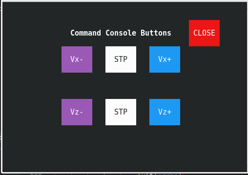
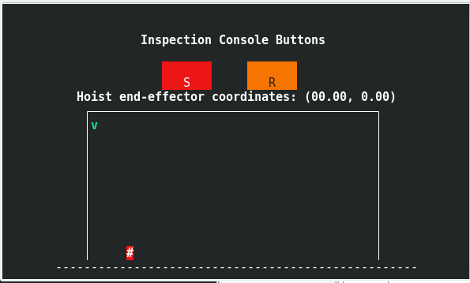

# github link
https://github.com/davideCaligola/advancedRobotProgramming/tree/assignment1
# Requirements
To compile the application it is required:
* ncurses library  
  under Ubuntu, it is possible to install it from command line:  
  `sudo apt install libncurses-dev`
* to use the application it is required that konsole from KDE is installed.  
  Under Ubuntu it is possible to install it from command line:  
  `sudo apt install konsole`.

# Build application
In a shell, under the root directory of the project, type the following command:  
`./build.sh`  
It will compile the sources under the directory `./src` and the binaries will be generated under the directory `./bin`.

# Run the application
To run the application, in a shell under the root directory of the project, type the following command:  
`./run.sh`

## Available options
It is possible to specify some parameter from command line to customize the application. The following options are available:
* `-h`  
  shows the help with the available options
* `-t` (integer, default 10)  
  specifies the watchdog timeout in seconds (minimum value 2s).
* `-s` (integer, default 1000)  
  specifies the sampling time in milliseconds the whole application will run (minimum value 30ms).
* `-n` (float, default 0.4)  
  specifies the noise amplitude that will added to the motor position. The noise will be pseudo-random uniform distribution in the range [-n,n].

### Example:
`./run -t 60 -s 100`  
It runs the application with a watchdog timeout of 60 seconds and a sampling time of 100 milliseconds.

# Application behaviour
The application opens two windows, a command console and an inspection console.  

  

## Command console
In the command console it is possible to controle the hoister movement.
The hoist can move at two velocity level:
- x-direction (horizontal), at 1 or 2 unit/s
- z-direction (vertical), at 0.25 or 0.5 unit/s

The velocity in the x-direction can be controlled with the buttons in the first row:
- Vx- decreases the velocity of 1 unit/s
- STP sets the velocity at 0
- Vx+ increases the velocity of 1 unit/s

The velocity in the z-direction can be controlled with the buttons in the second row:
- Vz- decreases the velocity of 0.25 unit/s
- STP sets the velocity at 0
- Vz+ increases the velocity of 0.25 unit/s

The button CLOSE closes the application.

## Inspection console
The inspection console displays the position of the hoist in the working area.  
The coordinates affected by the noise are displayed.  
The S button stops the movement of the hoist.  
The R button brings the hoist to the initial position (0,0). During this movement, all commands but the S button are not effective.

## Value update
A value is sent to another process only if it changes.

## Log files
Each created process will write a log file under the directory `./logs`.  
These files, if already present, will never be removed or overwritten. All new entries will be appended to the relative existing files.  
Each process will log whenever an event occurs, or a value changes. In case of periodic processes, like the motors or world processes where there could be frequent updates depending on the sampling time, to avoid to flood the logger, the minimum period of time between two logger entries is set as the maximum between 200ms and the sampling time (default value 1000, if not defined differently).  
If the position of a motor does not change, there will be not any logger entry.

## Watchdog
When all the log files are not modified before the watchdog timeout expires (default value 10s), the application will terminate automatically.

# Known issues
* If a process is killed or has an issue and exits prematurely, only such a process closes leaving all the other still running. They need to be killed manually, or, if still open the command console, it is possible to close the application clicking on the CLOSE button.  
* If the master process is killed or closes prematurely, all the child processes need to be closed manually.