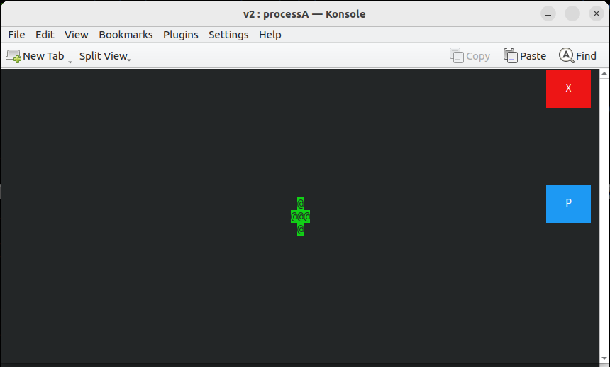
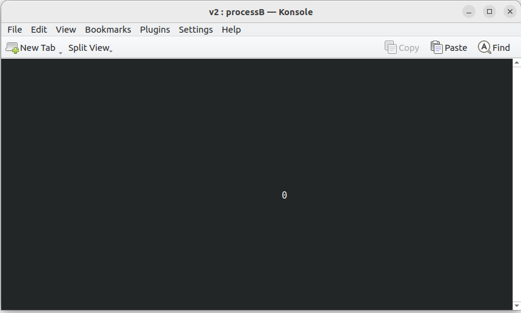
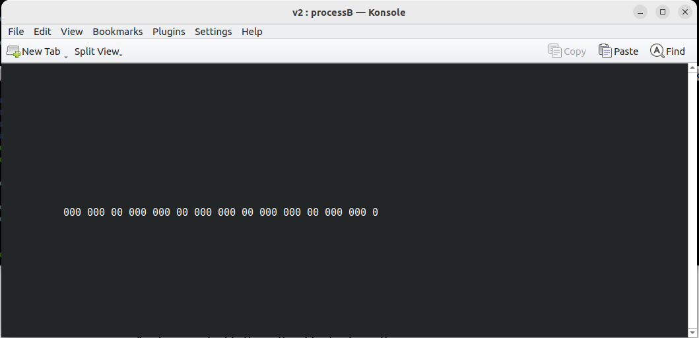
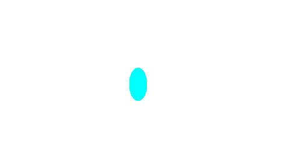

# github link
https://github.com/davideCaligola/advancedRobotProgramming/tree/assignment2
# Requirements
To compile the application it is required:
* `ncurses` library  
  Under Ubuntu, it is possible to install it from command line:  
  ```
  sudo apt install libncurses-dev
  ```
* `libbitmap` library  
  To work with the bitmap library, you need to follow these steps:
  1. Download the source code from [this GitHub repo](https://github.com/draekko/libbitmap.git) in your file system.
  2. Navigate to the root directory of the downloaded repo and run the configuration through command ```./configure```. Configuration might take a while.  While running, it prints some messages telling which features it is checking for.
  3. Type ```make``` to compile the package.
  4. Run ```make install``` to install the programs and any data files and documentation.
  5. Upon completing the installation, check that the files have been properly installed by navigating to ```/usr/local/lib```, where you should find the ```libbmp.so``` shared library ready for use.
  6. In order to properly compile programs which use the *libbitmap* library, you first need to notify the **linker** about the location of the shared library. To do that, you can simply add the following line at the end of your ```.bashrc``` file:  
   ```export LD_LIBRARY_PATH="/usr/local/lib:$LD_LIBRARY_PATH"```
* `konsole` from KDE  
  To use the application it is required that konsole from KDE is installed.  
  Under Ubuntu it is possible to install it from command line:  
  ```
  sudo apt install konsole
  ```

# Build application
In a shell, under the root directory of the project, type the following command:  
```
./build.sh
```
It will compile the sources under the directory `./src` and the binaries will be generated under the directory `./bin`.

# Run the application
To run the application, in a shell under the root directory of the project, type the following command:  
```
./run.sh
```

# Application behaviour
The application opens two konsole windows, a command window (processA) and a display window (processB).  

  

   

## Command window
In the command window, it is possible to move the circle with the arrow keys within the delimited area.  
There are available two buttons:
* exit button (X)  
  Red button on the upper-right corner. It closes the application.
* print button (P)  
  Print a .bmp image of the current position of the circle scaled on an image with resolution 1600x600 pixels. The name of the file is `circle.bmp` and it is placed in the directory `out` under the root directory of the project. If a file with the same name is already present, an increasing number will be added (i.e. `circle_1.bmp`)  
  The message `bmp saved` is prompted at the bottom-left corner of the window (for 1 second) when the process has been completed.

## Display window
The display window draws the trajectory of the circle center reading the shared image 1600x600. Since the center is estimated based on an image with different resolution of the display window and of the command window, it is possible that some position, because of rounding issue and different window size, are missing (see [Know limitations](#known-limitations) for more details).

# Known limitations
## resizing display window  
The window will be completely cleared and it will display only a black window. As soon as the cursor in the command window is moved again, the circle center position is correctly displayed.

## missing positions  
Depending on the size of the display and command windows, there could be some missing position. In the following example, the display window has a size larger than the command window:  

   

## saved bitmap circle is an ellipse
The resolution of the output file is fixed to 1600x600 pixels. However, the command window can have a variable size. For this reason, if the proportion between the two is not the same, the saved bitmap file will generally show an ellipse instead of a circle.  



## saved file name
The file name is `circle.bmp` and in case a file with this name already exists, an incremental number is appended to it.  
The algorithm has, among the others, the following limitations:  
* scanning for the name in the `out` directory, it does not distinguish between directories and files.
* to choose the number to append to the file name, the algorithm will check the greatest number already appended to the file, such as `circle_server_XX.bmp`. For this reason, it is possible that the numbering is not consecutive.

## crash - clean up  
In case of crash because of some internal error, by design the involved process will just terminate itself.  
Both process A and B are launched within a konsole with the option `--hold`. In this case when one of the process terminates itself, the konsole will stay open displaying the error message causing the failure.  
In case of a master process failure, the error message is displayed directly on the console where the application has been launched.  
In case of crash, it is suggested to remove shared resources possibly not cleaned up allocated under `/dev/shm` with the following command:  
```
rm /dev/shm/sharedPicture /dev/shm/sem.semaphore_write /dev/shm/sem.semaphore_read
```